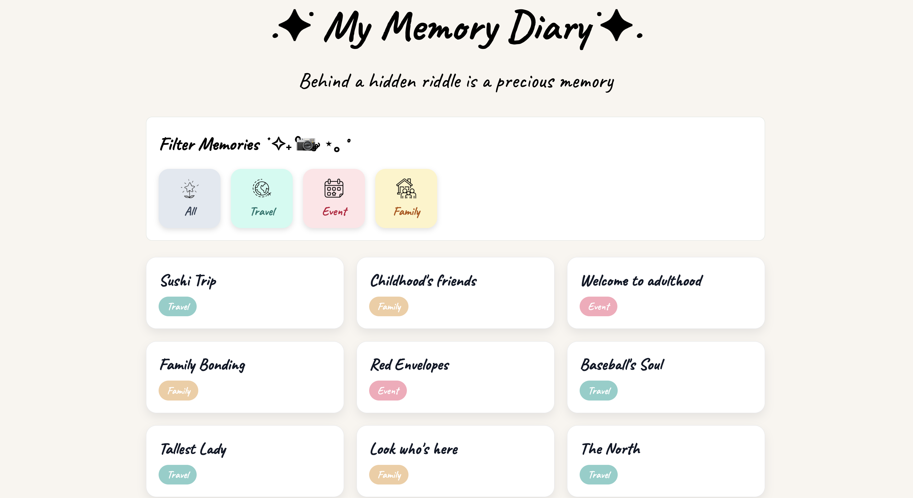

# ✨ Memory Diary Catalog - Snap Engineering Academy Stage 2 Project

Welcome to My Memory Diary, a site that will take you down through all your different memory lanes, along with some fun quiz questions to bring you back to a time when that memory took place. 

This project was created as a part of the Snap Engineering Academy Stage 2 and was built using vanilla HTML, CSS, and JavaScript.



---

## ⭐️ Project Features
- **Data Catalog:** 21 memory cards with detailed titles, tags, images, quiz questions and options, and notes.
- **Filtering:** Filter memory cards by tag (All, Travel, Event, Family).
- **Hidden Riddle:** Each diary card will have a ridden riddle as it's title to spark curiosity.
- **Quiz:** Quiz questions for each memory are personally related to that memory.
-**Quiz Status Badge:** Let the user know whether they have successfully passed the quiz or need to retry. Avoid redo the completed card.
- **Note:** Each memory card will have a note that the user wrote before. To unlock the note for a memory, users must answer all questions about that memory correctly. They can also edit or delete a note. 
**Completed Memories:** A completed memory can be reopened without retaking the quiz during the current session.
**Responsive Design:** Looks great across desktop, tablet, and mobile devices.

---

## 🧩 Technologied Used
- HTML
- CSS
- JavaScript

---
## 🚀 How to Run
1. Clone or download this repository
2. Open `index.html` in any modern web browser (Chrome recommended).
3. Explore the catalog and enjoy the hunt for Hidden Mickeys!

Or, visit the **live GitHub Pages version** here:  

---
## 📚 Data Structure 

All memory cards are stored in a structured JavaScript array of objects inside `script.js`.
Each diary object contains:

```javascript
{
    id: "japan-trip-1",
    title: "Sushi Trip",
    tag: "Travel",
    image: "/images/japan/Oishi-Park.jpeg",
    note: "Had a great time visiting Oishi Park in Japan. Although the weather was a bit cloudy, the view of Mount Fuji was breathtaking!",
    questions: [
      {
        question: "What is the location of this place?",
        options: ["Japan", "China", "South Korea"],
        answer: "Japan" 
      },
      {
        question: "Who are you traveling with?",
        options: ["Family", "Friends", "Alone"],
        answer: "Friends"
      },
      {
        question: "What year did you go?",
        options: ["2020", "2022", "2025"],
        answer: "2025"
      }
    ]
  }
```

---
## 💌 A Note from Vivian
This project was created to make memory recall more engaging and personal. It shows my passion for photos, storytelling, creative, thoughtful design, and community.

My hope while building this is not just to have fun looking at your memory, but also to help people with Alzheimer's or older adults revisit their meaningful memories through a simple, interactive experience.  